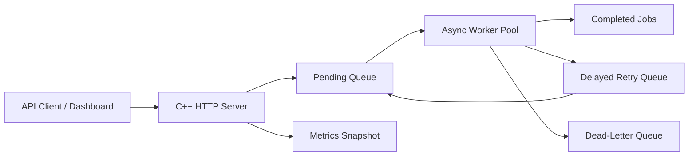

# Scalable Distributed Job Queue System

A C++17 asynchronous job queue service with automatic retries, delayed retry scheduling, a dead-letter queue, JSON metrics, and a browser dashboard.

## What It Includes

- Asynchronous processing with configurable worker threads.
- Automatic retry after failures.
- Dead-letter queue for jobs that exceed the retry limit.
- Dashboard showing queued, running, completed, failed, retried, and dead-lettered jobs.
- Arrival time tracking for every job.
- REST API for submitting jobs and inspecting system state.
- Docker and Docker Compose deployment.

## Run Locally

```powershell
cmake -S . -B build
cmake --build build
.\build\Debug\job-queue.exe
```

Open [http://localhost:8080](http://localhost:8080).

## Run Tests

```powershell
cmake -S . -B build
cmake --build build
ctest --test-dir build --output-on-failure
```

## Deploy With Docker

```powershell
docker compose up --build
```

Open [http://localhost:8080](http://localhost:8080).

## API

Submit a job:

```bash
curl -X POST http://localhost:8080/jobs \
  -H "Content-Type: application/json" \
  -d "{\"type\":\"email\",\"payload\":\"send welcome email\",\"failuresBeforeSuccess\":1}"
```

Create a job that will end in the dead-letter queue:

```bash
curl -X POST http://localhost:8080/jobs \
  -H "Content-Type: application/json" \
  -d "{\"type\":\"billing\",\"payload\":\"charge customer\",\"failuresBeforeSuccess\":99}"
```

Read metrics:

```bash
curl http://localhost:8080/metrics
```

Read recent jobs:

```bash
curl http://localhost:8080/jobs
```

Read dead-lettered jobs:

```bash
curl http://localhost:8080/dead-letter
```

## Configuration

Environment variables:

- `JOB_QUEUE_PORT`: HTTP port, default `8080`.
- `JOB_QUEUE_WORKERS`: worker thread count, default `4`.
- `JOB_QUEUE_MAX_RETRIES`: retry attempts before dead-lettering, default `3`.
- `JOB_QUEUE_RETRY_DELAY_MS`: delay before retry, default `1500`.

## Architecture



This implementation is intentionally dependency-light and easy to deploy. In a production multi-node setup, the in-memory queue can be replaced with Redis, Kafka, RabbitMQ, or a database-backed queue while keeping the same retry/dead-letter/dashboard model.
